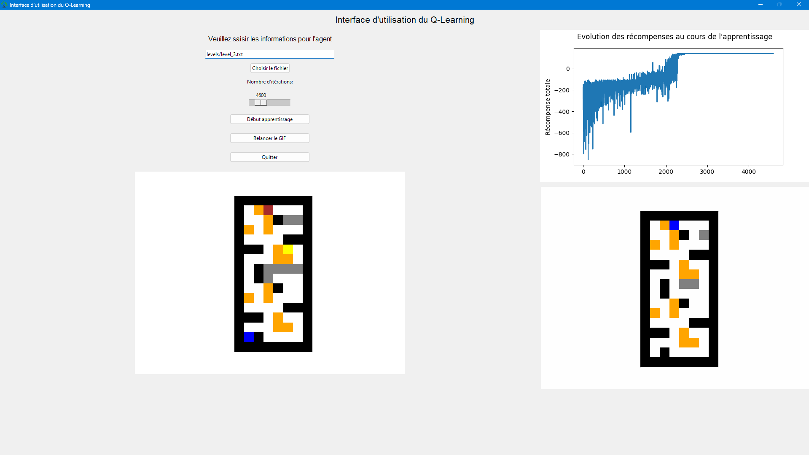

# Agent - Apprentissage par Renforcement

## Description du Projet
Ce projet a pour objectif de développer un agent capable d'apprendre à travers **l'apprentissage par renforcement** (Reinforcement Learning) et de l'appliquer à un jeu simple de type labyrinthe. L'agent devra explorer le labyrinthe pour trouver une clé, puis un coffre, en s'appuyant sur une **Q-table** pour naviguer efficacement. Une interface utilisateur (GUI) permet de sélectionner différents niveaux de difficulté et de visualiser l'apprentissage de l'agent à travers une animation sous forme de GIF.

## Objectifs du Projet
1. **Compréhension de l'apprentissage par renforcement** : Apprendre les concepts de base et les principes du Reinforcement Learning.
2. **Mise en pratique** : Implémenter un agent qui résout un problème simple dans un environnement de labyrinthe.
3. **Création d'un jeu** : Le jeu consiste à naviguer dans un labyrinthe pour récupérer une clé et ouvrir un coffre en se basant sur l'amélioration continue via une Q-table.
4. **Documentation et rapport** : Fournir un rapport détaillé pour faciliter la reprise du projet par d'autres utilisateurs.
5. **Interface graphique (GUI)** : Proposer une interface simple permettant de choisir le niveau de difficulté, de lancer l'apprentissage et d'afficher un GIF du déplacement de l'agent.

## Fonctionnalités
- **Apprentissage par Renforcement** : Utilisation de l'algorithme Q-learning pour optimiser le comportement de l'agent dans le labyrinthe.
- **Interface Utilisateur** : Sélection du niveau, lancement de l'apprentissage et visualisation du parcours de l'agent sous forme de GIF.
- **Visualisation de l'apprentissage** : Génération automatique d'un GIF (`agent.gif`) qui montre les déplacements de l'agent dans le labyrinthe.
- **Rapport** : Le projet est accompagné d'un rapport détaillé (disponible dans le fichier `Rapport_TX.pdf`) qui explique la méthodologie utilisée, les choix techniques et les résultats obtenus.



## Prérequis
Avant d'exécuter ce projet, assurez-vous d'avoir installé les dépendances suivantes :
- Python 3.x
- Bibliothèques Python : `numpy`, `matplotlib`, `tkinter`, etc.

Vous pouvez installer les dépendances nécessaires avec la commande suivante :
```bash
pip install -r requirements.txt
```

## Rapport
Un rapport détaillant l'approche utilisée, les résultats et les améliorations possibles est disponible dans le fichier `Rapport_TX.pdf`. Ce document est conçu pour aider toute personne souhaitant approfondir ou continuer ce projet.

## Auteurs
- [Sacha S.](github.com/sacha-sz)
- [Theo D.](github.com/theodubus)