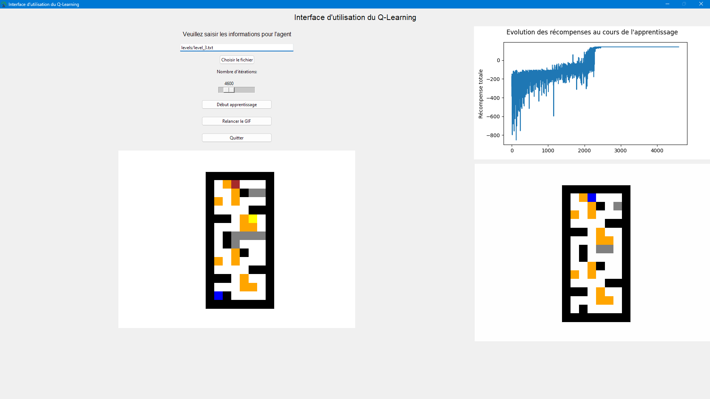

# TX - Apprentissage par Renforcement en Labyrinthe

Ce dépôt regroupe les travaux réalisés dans le cadre d'une **TX** (travail en autonomie) à l'UTC, portant sur l'**apprentissage par renforcement** (Reinforcement Learning).

Le projet consiste à entraîner un agent à naviguer dans des labyrinthes à difficulté croissante. L'agent doit récupérer une clé puis ouvrir un coffre, en apprenant une politique optimale grâce à un algorithme de **Q-learning**. Une interface graphique permet de sélectionner le niveau, de lancer l'entraînement et de visualiser le résultat sous forme de GIF animé.

<br/>

## Vue d'ensemble

| Composant | Description |
|-----------|-------------|
| `main.py` | Point d'entree - lance l'interface graphique |
| `src/env.py` | Classe `Env_level` - environnement du labyrinthe |
| `src/agent.py` | Algorithme Q-learning (Q-table, epsilon-greedy, enregistrement GIF) |
| `src/gui.py` | Interface graphique Tkinter |
| `levels/` | 8 niveaux de labyrinthe au format texte, de difficulte croissante |
| `tests/` | Tests unitaires (pytest) |
| `docs/Rapport_TX.pdf` | Rapport detaille de la methodologie, des choix techniques et des resultats |
| `outputs/agent.gif` | GIF genere automatiquement apres l'entrainement |

<br/>

## Environnement

Le labyrinthe est représenté par une grille dont chaque case correspond à un type d'élément :

| Symbole | Type | Description |
|---------|------|-------------|
| `#` | Mur | Case infranchissable |
| `.` | Vide | Case accessible |
| `P` | Joueur | Position initiale de l'agent |
| `K` | Clé | A récupérer avant le coffre |
| `C` | Coffre | Objectif final |
| `L` | Lave | Case pénalisante |
| `B` | Mur cassable | Franchissable au coût d'une pénalité |

L'agent dispose de 4 actions possibles : haut, bas, gauche, droite. L'état encode la position de l'agent, la possession de la clé et la présence de murs cassables adjacents.

---

### Système de récompenses

| Evenement | Récompense |
|-----------|-----------|
| Récupérer la clé | +100 |
| Ouvrir le coffre | +100 |
| Tomber dans la lave | -100 |
| Frapper un mur | -10 |
| Sortir des limites | -10 |
| Casser un mur | -5 |
| Chaque action | -1 |

---

### Niveaux disponibles

8 niveaux de difficulté croissante sont disponibles dans le dossier `levels/`, de `level_1.txt` à `level_8.txt`. Chaque niveau introduit de nouveaux obstacles (lave, murs cassables, chemins complexes).

<br/>

## Fonctionnalités

- **Q-learning** - Apprentissage d'une politique optimale via une Q-table mise à jour à chaque épisode.
- **Interface graphique** - Sélection du niveau, lancement de l'entraînement et visualisation en temps réel.
- **Génération de GIF** - Export automatique du parcours optimal de l'agent après entraînement (`outputs/agent.gif`).
- **Rapport** - Document `docs/Rapport_TX.pdf` décrivant la méthodologie, les résultats et les pistes d'amélioration.



<br/>

## Utilisation

Un environnement Python 3 suffit. Installez les dépendances puis lancez le programme principal.

```bash
# Cloner le dépôt
git clone https://github.com/sacha-sz/UTC-TX-RL.git
cd UTC-TX-RL

# Installer les dépendances
pip install -r requirements.txt

# Lancer l'application
python main.py
```

**Commandes disponibles via Makefile :**

```bash
make install      # Installer les dépendances
make run          # Lancer l'application
make test         # Exécuter les tests
make lint         # Vérifier le style du code
make clean        # Nettoyer les fichiers générés
```

1. Sélectionner un niveau dans l'interface graphique.
2. Lancer l'entraînement - l'agent apprend en simulant plusieurs épisodes.
3. Visualiser le GIF généré (`outputs/agent.gif`) représentant le parcours optimal trouvé.

<br/>

## Technologies utilisées

- **Python 3** - langage principal
- **NumPy** - représentation de la grille et calcul de la Q-table
- **Matplotlib** - rendu visuel du labyrinthe
- **Tkinter** - interface graphique
- **Pillow / imageio** - génération du GIF animé

<br/>

## Références

- [Cours Deep RL - Hugging Face](https://huggingface.co/learn/deep-rl-course/unit0/introduction)
- [UTC - Université de Technologie de Compiègne](https://www.utc.fr/)

<br/>

## Auteurs

- **[@sacha-sz](https://github.com/sacha-sz)**
- **[@theodubus](https://github.com/theodubus)**

<br/>

## Licence

Ce projet est distribué sous licence **MIT** - voir le fichier [LICENSE](LICENSE) pour plus d'informations.
